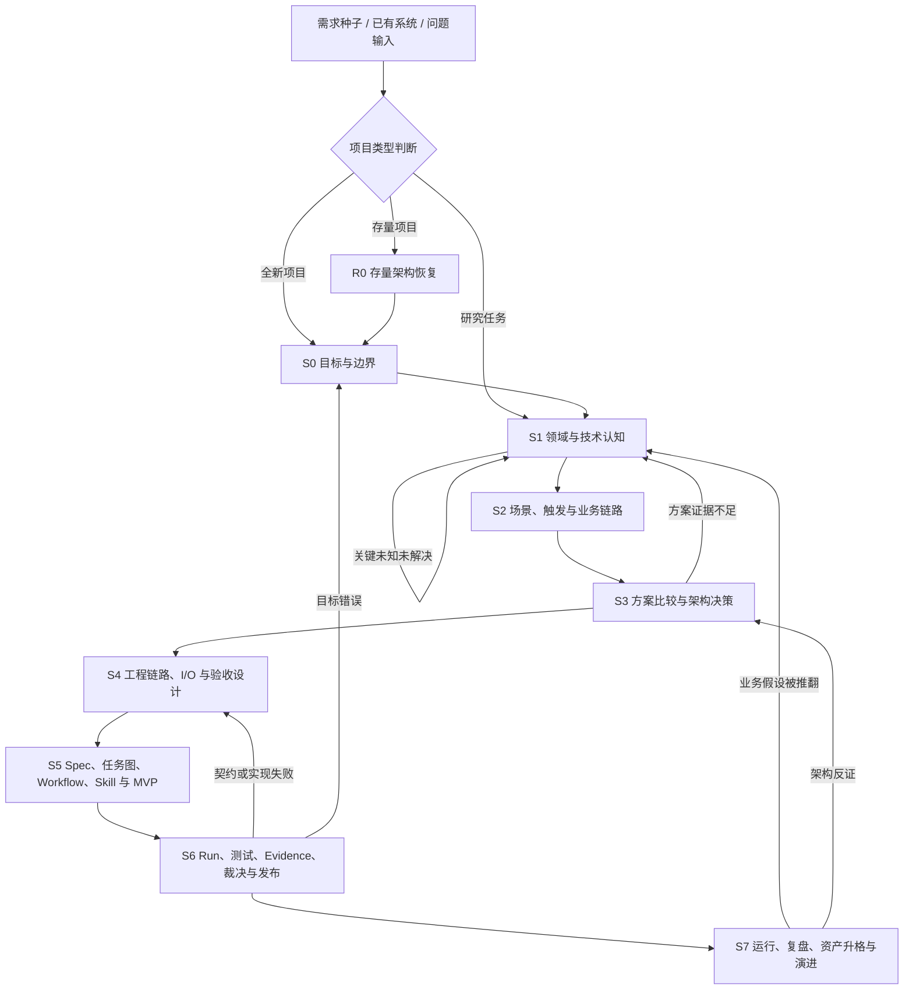

# AI Project OS 项目推进操作骨架补全设计

- 状态：待用户复核书面规格
- 日期：2026-07-11
- 方案：标准版方案 B
- 目标：补齐“治理内核已经存在，但人类总入口、推进主流程和标准产物包不足”的结构缺口

## 1. 问题判断

当前仓库已经具备较强的治理内核：L1/L2/L3 边界、框架等级、项目治理路由、受控对象、状态失效、权限、AI 审核、Run/Evidence/Verdict/Claim 和评分边界均有正式定义。

当前主要缺口不是继续增加治理概念，而是缺少一条面向项目执行者的操作骨架：

1. 没有一张把项目生命周期、追溯链、执行链和证据链放在一起的总图；
2. R0、S0—S7 只有高层退出描述，没有逐阶段机器可检查的输入、产物、门禁、证据和重开协议；
3. “需求种子到完成声明”的修正后推进流程散落在多个权威文件中；
4. 链路包、Spec 包、I/O、Workflow、Skill、L3 项目实例缺少标准模板；
5. 能力树、功能树、任务树的生成顺序和权威落点没有统一入口；
6. L1 关键术语没有统一中文语义表；
7. `policies/` 同时承载决策规则和大量 `*-contract.yaml`，长期边界不清；
8. 当前 README、机器成熟度和多个评分快照存在阅读口径冲突。

## 2. 决策

采用“人类操作骨架 + 机器门禁契约 + 标准产物模板”的补全方式，不立即建设完整运行平台。

本方案新增或强化六类资产：

1. AI Project OS 人类总览和总图；
2. 完整项目推进工作流；
3. R0、S0—S7 阶段出口门禁；
4. L1 关键术语统一表；
5. 链路包、Spec 包、I/O、Workflow、Skill 和项目实例模板；
6. 契约与政策目录边界及相应检查器。

不建设以下能力：

- 持久工作流引擎；
- 多智能体运行平台；
- 生产发布平台；
- 企业项目组合系统；
- 未经研究批准的第三方运行依赖；
- 与当前业务系统绑定的固定业务链路、关键词或商品数据。

## 3. 四条不能混成一条的主线

### 3.1 项目推进控制流

回答“项目下一步应该做什么”：

```text
需求种子/存量系统
→ 项目类型判断
→ 治理路由
→ 阶段定位
→ 研究与认知
→ 场景和链路
→ 架构决策
→ 工程设计
→ 计划与最小实现
→ 验证发布
→ 运行演进
```

### 3.2 产物追溯依赖链

回答“每个产物为什么存在”：

```text
来源
→ 批准事实/需求
→ 场景/触发
→ 业务链路
→ 业务能力/用户功能
→ 架构决策/技术能力/组件/工程链路
→ I/O 契约与验收判据
→ Spec 控制包
→ Task 依赖图
→ Workflow
→ Skill/Tool
→ Run
→ AI 审核与 Evidence
→ 验收裁决
→ 完成声明
→ 复盘与资产演进
```

### 3.3 状态坐标

回答“对象现在处于什么状态”：生命周期、工作状态、审批状态、实现状态、证据等级和失效状态分别记录，禁止用一个 `completed` 代替。

### 3.4 框架和项目配置

回答“系统建设多大、项目采用哪些控制”：框架等级、基础治理配置和可叠加能力互不推导，也不从生命周期或证据等级推导。

## 4. AI Project OS 总图



总图只作为人类阅读入口。阶段、对象、状态和门禁的机器枚举继续由各自权威维护，禁止在总图文件建立第二套可编辑真相。

## 5. R0、S0—S7 出口门禁

| 阶段 | 必需产物 | 出口门禁 |
|---|---|---|
| R0 存量恢复 | 当前架构、入口清单、反向需求、孤儿实现、差距矩阵、迁移计划 | 所有活动入口已登记；关键实现有来源或标为孤儿；P0/P1 差距有负责人和处置路径 |
| S0 目标边界 | 目标、非目标、角色、成功指标、需求基线、项目类型、治理路由 | 范围和验收分母锁定；负责人批准；重大歧义为零 |
| S1 认知研究 | 来源登记、术语、事实、假设、未知、研究包和研究裁决 | 关键未知已解决、接受风险或存在安全后备路径；关键结论有来源或实验 |
| S2 场景链路 | 场景目录、触发档案、链路包、正常/异常/恢复链、能力视图 | P0/P1 需求均被场景和链路覆盖；每条链有责任主体、失败出口和恢复路径 |
| S3 架构决策 | 质量属性、候选方案、评分、反方报告、ADR、目标架构 | 关键选择有证据、后果、退出条件和重审条件；致命反方问题为零 |
| S4 工程设计 | 组件、工程链路、I/O、失败契约、权限和验收判据 | 跨组件接缝可验证；失败语义、兼容、权限和回滚完整 |
| S5 计划执行 | Spec 五件套、任务依赖图、Workflow、Skill/Tool、最小纵向实现 | 无孤儿任务；任务追溯到 Spec 和验收；工作包可执行、暂停、恢复和失败返回 |
| S6 验证发布 | 测试、Run、Evidence、AI 审核裁决、验收裁决、发布和回滚决策 | 退出码与语义断言通过；P0/P1 为零；证据新鲜；声明不超过证据等级 |
| S7 运行演进 | 指标、事故、成本、恢复记录、复盘和资产生命周期记录 | 运行责任和恢复链成立；反例进入上游重开；可复用资产完成升格或淘汰 |

每个阶段门禁必须形成机器记录，至少包含：阶段、范围、所需对象、所需证据等级、检查命令、结果、未覆盖项、豁免、批准人、验证人、时间、失效条件和重开目标。

## 6. 标准产物包

### 6.1 链路包

```text
templates/chain-package/
├── chain.yaml
├── scenarios.md
├── triggers.yaml
├── business-flow.md
├── exceptions.md
├── recovery.md
├── responsibility-map.md
├── io-map.yaml
├── traceability.md
├── acceptance.md
└── diagrams/
```

链路包属于 L2 业务系统。L1 只保存契约和模板，不保存具体业务链路。

### 6.2 Spec 控制包

```text
templates/spec-package/
├── spec.md
├── plan.md
├── tasks.md
├── acceptance.md
└── traceability.md
```

`tasks.md` 是单个 Spec 的任务权威；跨 Spec 任务总树是生成视图，不建立第二套可编辑任务真相。

### 6.3 I/O 契约模板

至少覆盖 producer、consumer、请求/事件/结果 Schema、成功/失败 envelope、错误分类、重试、幂等、超时、顺序、部分结果、数据分类、兼容、契约测试和迁移。

### 6.4 Workflow 模板

至少覆盖触发、Task 引用、步骤图、执行节点、I/O、权限、预算、超时、重试、checkpoint、取消、补偿、失败路由、终态、Evidence 出口和声明上限。

### 6.5 Skill 模板

至少覆盖消费者、局部职责、输入输出、模型/代码边界、权限、失败返回、评测、版本和兼容范围。Skill 禁止隐藏跨阶段 Workflow。

### 6.6 L3 项目实例模板

至少覆盖项目配置、治理路由锁定、项目事实、数据目录、Run、Evidence、Verdict、Claim、交付物和项目隔离 namespace。

## 7. 能力树、功能树和任务树

唯一推导顺序：

```text
业务链路 → 业务能力树 → 用户功能视图 → 架构和 Spec
Spec + 验收判据 → Task 依赖图 → Workflow → Skill/Tool
```

推荐 L2 落点：

```text
domain/capability-map/       # 批准业务能力
design/function-map/         # 用户功能视图
chains/{chain_id}/           # 链路包
specs/{spec_id}/tasks.md     # 单个 Spec 的任务权威
views/task-tree.md           # 跨 Spec 生成视图
```

能力树、功能树和任务树均不得保存到 `.prompts/`。原始灵感只能进入来源或候选区，经批准后才进入正式对象。

## 8. 目标目录结构

```text
ai-project-os/
├── README.zh-CN.md
├── project-os.yaml
├── docs/
│   ├── architecture/
│   │   ├── AI_PROJECT_OS_OVERVIEW.md
│   │   ├── AI_PROJECT_OS_CORE.md
│   │   ├── FRAMEWORK_EDITION_MODEL.md
│   │   └── REPOSITORY_AND_LAYER_CONTRACT.md
│   ├── workflows/
│   │   ├── PROJECT_DELIVERY_WORKFLOW.md
│   │   ├── PROJECT_LIFECYCLE.md
│   │   ├── STAGE_EXIT_GATES.md
│   │   └── ARCHITECT_WORKFLOWS.md
│   ├── governance/
│   │   ├── TERMINOLOGY.md
│   │   ├── CONTROLLED_OBJECT_MODEL.md
│   │   ├── STATE_TRANSITIONS_AND_INVALIDATION.md
│   │   ├── RUN_EVIDENCE_ACCEPTANCE.md
│   │   └── GATES_PROOF_SCORING.md
│   └── research/
├── contracts/
│   ├── governance/
│   ├── artifacts/
│   ├── execution/
│   └── io/
├── policies/
├── templates/
│   ├── system-project/
│   ├── project-instance/
│   ├── chain-package/
│   ├── spec-package/
│   ├── io-contract/
│   ├── workflow/
│   ├── skill/
│   └── research-package/
├── workflows/
├── skills/
├── linters/
├── adapters/
├── fixtures/
├── tests/
├── decisions/
├── research/
└── reviews/
```

目标目录必须完整定义，但物理目录只在首个正式资产出现时创建。`apps/`、`libs/`、`tools/` 仅在形成真实 CLI、服务或可导入内核时创建，不为未来可能性建立空目录。

## 9. `contracts/` 与 `policies/` 的边界

- `contracts/`：保存对象结构、I/O、manifest、版本、失败语义和兼容要求；
- `policies/`：保存路由、风险判断、授权决策、门禁和声明封顶规则。

现有 `policies/*-contract.yaml` 应在实施阶段通过 Git move 迁入 `contracts/governance/`，同时更新 `project-os.yaml`、文档引用、测试和检查器。迁移必须使用一份 ADR 或迁移记录，不能复制后保留两个权威文件。

## 10. 关键术语统一范围

新增 L1 术语权威，至少统一：来源、业务真相、研究、框架等级、基础治理配置、叠加能力、生命周期、工作状态、实现状态、证据等级、业务链路、工程链路、Workflow、Skill、Tool、能力树、功能树、任务图、Spec、Run、Evidence、Verdict 和 Claim。

稳定英文机器标识保留；中文定义必须唯一，其他文档引用术语权威，不能自行给同一词增加第二种含义。

## 11. 评分

### 11.1 当前分数不能写成一个数字

当前存在三个不同口径：

- 历史 P0 设计快照为 84，仅代表当时范围和硬封顶；
- 当前总体评分入口仍有 `not_evaluated`，因此不能把 84 当成当前有效总分；
- 人工规则治理与 AI 审核子方案的目标设计分为 96，但它明确禁止解释为当前得分。

因此，当前 AI Project OS 的有效总体专家评分是 `not_evaluated`。静态契约和检查器已有局部证据，但还不能合并为通用 95+ 声明。

### 11.2 方案 B 的目标设计分

按 `weighted-geometric-v1` 公式，本方案目标维度为：

| 维度 | 目标分 |
|---|---:|
| 系统边界与分层 | 97 |
| 生命周期与推进闭环 | 97 |
| 来源、事实、研究与决策 | 95 |
| 产物职责与追溯 | 97 |
| Workflow、执行和恢复 | 95 |
| AI 原生上下文、模型和工具治理 | 95 |
| 安全、权限与项目隔离 | 95 |
| 测试、证据和完成声明 | 96 |
| 演进、兼容和资产生命周期 | 95 |
| 中文可读性与使用体验 | 98 |

加权几何目标分为 `95.93`，无处罚时可表述为“目标设计 95+”。它是批准方案的设计目标，不是当前证据分、实现分或运行证明分。

## 12. 达到可证明 95+ 的紧急路径

仅补文档不能获得可证明 95+。最短闭环必须同时解除四个硬封顶：

1. **解除 84 封顶**：建立一条端到端 fixture 纵向链，覆盖需求、链路包、Spec、Task、Workflow、Skill/Tool、Run、Evidence、Verdict 和 Claim，并完成暂停/恢复或失败重开实验；
2. **解除 89 封顶**：提供双项目 namespace、权限、缓存、证据和秘密隔离的正反例测试；
3. **解除 94 封顶**：由独立于设计和实现主体的反方评审者重新评分，保存逐维原始分、处罚项、命令和 Evidence；
4. **允许声明通用 95+**：至少两个异构真实 L2 项目完成只读或本地接入验证，不能使用同一业务复制品充数。

紧急路径可以把生产运行排除在评分 scope 外，声明范围限定为“standard 框架设计、契约测试、fixture 运行和异构 L2 本地/只读验证”。如果声明包含生产就绪，还必须增加经批准生产 Run、外部回执、恢复演练和责任链，不能用上述 95+ 替代生产证明。

## 13. 实施顺序

1. 修正 README、`project-os.yaml.maturity` 和评分入口冲突；
2. 新增总览、推进工作流、阶段门禁和术语权威；
3. 分离 contracts 与 policies；
4. 建立链路包、Spec、I/O、Workflow、Skill 和项目实例模板；
5. 扩展检查器，验证阶段门禁、模板包完整性、术语漂移和图覆盖；
6. 建立端到端正反例 fixture；
7. 完成第一个 L2 存量项目接入；
8. 完成第二个异构 L2 项目接入；
9. 独立反方复核并生成不可变评分快照。

## 14. 验收条件

- 存在唯一的人类总览入口，能够在一页内理解四条主线；
- R0、S0—S7 每阶段均有输入、必需产物、出口门禁、Evidence 和重开目标；
- 链路包、Spec、I/O、Workflow、Skill 和 L3 项目实例模板均可被检查器扫描；
- 能力树、功能树、任务图的生成顺序和唯一权威落点明确；
- `contracts/` 与 `policies/` 不再混放；
- L1 术语只有一个中文定义位置；
- README 与机器成熟度、评分入口和工作树事实一致；
- 当前分、目标设计分、静态实现分、fixture 证明、本地证明和生产证明分别报告；
- 任何 95+ 声明均绑定不可变快照、可重放命令、独立审查和明确 scope。
